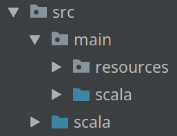
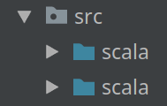

# Reproduce Bazel IntelliJ Project View Issue

This repository demonstrates the Bazel IntelliJ project view issue.

## Steps for reproduction

- Install the following version of IntelliJ IDEA or similar
    ```
    IntelliJ IDEA 2018.2.5 (Community Edition)
    Build #IC-182.4892.20, built on October 16, 2018

    JRE: 1.8.0_152-release-1248-b6-amd64
    JVM: OpenJDK 64-Bit Server VM by JetBrains s.r.o
    ```
- Install the following version of the Bazel IntelliJ plugin from ij.bazel.build.
    ```
    2018.10.08.0.2
    ```
- Download this repository.
- Import this repository as follows.
    - "Import Bazel Project"
    - "Workspace": Select this repository
    - "Next"
    - "Generate from BUILD file"
    - "BUILD file": Select the `BUILD` file in this repository
    - "Next"
    - Leave all defaults except modify the "Project View" to enable Scala support.
        ```
        directories:
          .

        targets:
          //...:all

        additional_languages:
          # Uncomment any additional languages you want supported
          # android
          # dart
          # kotlin
          # python
          scala
        ```
    - "Finish"
- Unfold the repository folder in the "Project" pane.
- Unfold the "src" item.
- Unfold the "main" item.
- Observe two "scala" entries as shown here:

    

    Expectation: The tree should look like this:
    ```
    src
    ├── main
    │   ├── resources
    │   └── scala
    └── test
        └── scala
    ```
- Delete the `src/main/resources` directory.
- Observe two "scala" entries as shown here:

    

    Expectation: The tree should look like this:
    ```
    src
    ├── main
    │   └── scala
    └── test
        └── scala
    ```
